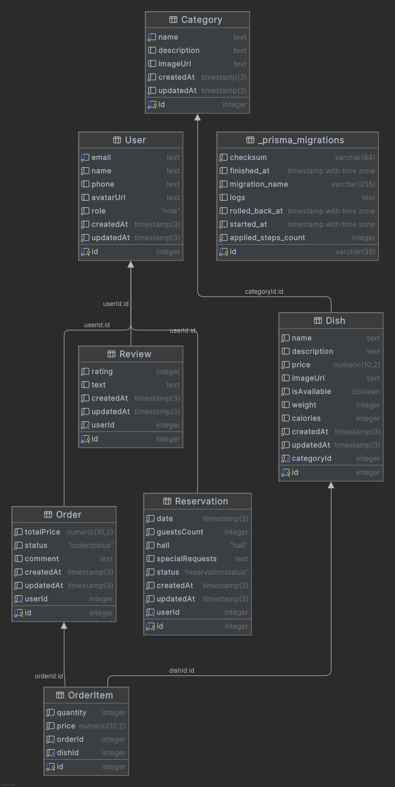

## Кто я?

Меня зовут Филевская Анастасия и я студентка 3-его курса ИТМО направления "Информационные системы и технологии".

## Немножко описания:

[Мой проект](https://m3314-filevskaya-backend.onrender.com) включает в себя сайт ресторана Blossom, на котором можно забронировать зал, заказать еду онлайн, оставить отзыв.

## Для проверки работоспособности шаблонизаторов:

```
http://localhost:3000/
http://localhost:3000/?auth=true
http://localhost:3000/?auth=false
http://localhost:3000/reviews/add
http://localhost:3000/reviews/1/edit

https://m3314-filevskaya-backend.onrender.com
```

## Доменная модель — ресторан Blossom



### Сущности
- **Category** — категории блюд (первые блюда, салаты, десерты и т.д.)
- **Dish** — блюда меню с ценой, описанием и привязкой к категории
- **User** — пользователи с ролями CUSTOMER и ADMIN
- **Reservation** — бронирования залов с датой, количеством гостей и выбором зала
- **Order** — заказы пользователей со статусом и итоговой суммой
- **OrderItem** — позиции внутри заказа (блюдо + количество + цена на момент заказа)
- **Review** — отзывы пользователей с рейтингом от 1 до 5
